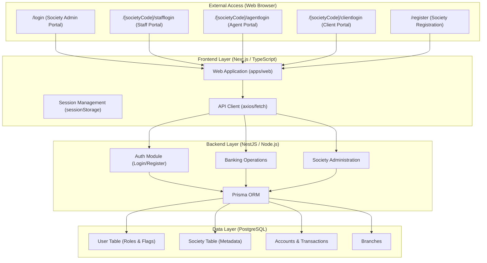

# Information Society Software System Structure

This document provides a high-level overview of the Information Society Software architecture, highlighting how different user roles access the platform and how data flows through the system.

## 1. System Architecture Diagram

## 2. Key components and roles

### User Roles
- **Society Admin**: The root user of a society. Created during registration. Has `isSocietyAdmin: true`.
- **Staff member**: Society employees. Have role `SUPER_USER` but `isSocietyAdmin: false`. Must log in via the designated staff portal.
- **Agent**: Field agents who collect deposits. Have role `AGENT`.
- **Client**: End members/customers. Have role `CLIENT`.

### Portals
- **Admin Portal (`/login`)**: Restricted to **Society Admins** only. This is where the society configuration and top-level management happened.
- **Staff Portal (`/[societyCode]/stafflogin`)**: Where society employees log in to perform daily banking operations based on their permissions.
- **Agent/Client Portals**: Dedicated entry points for field work and customer self-service.

## 3. Data Flow (Prisma)
All information provided during registration or creation is mapped directly to the Postgres database through Prisma models:
- **Society Metadata**: Captures registration dates, PAN/GST numbers, billing details, and capital information.
- **User Identity**: Stores hashed passwords, Aadhaar details (if provided), and role-based access tokens.
- **Permission System**: Uses `allowedModuleSlugs` to dynamically enable or disable features (tabs) on the dashboard for staff members.

## 4. Tab Access logic
The dashboard checks the user's `isSocietyAdmin` flag and `allowedModuleSlugs` array to render the appropriate sidebar items. If a staff member is missing a tab, it is usually because that specific module slug is not present in their `allowedModuleSlugs` record in the database.
